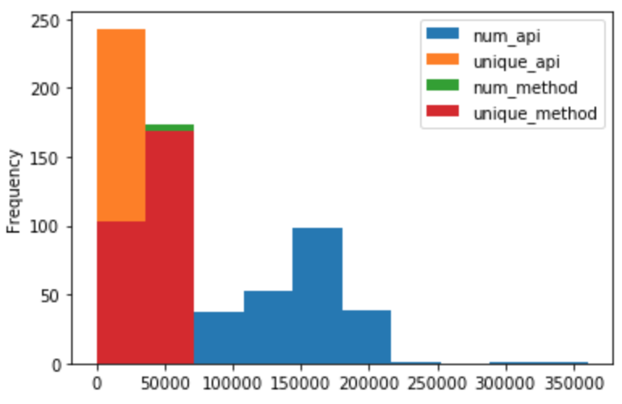
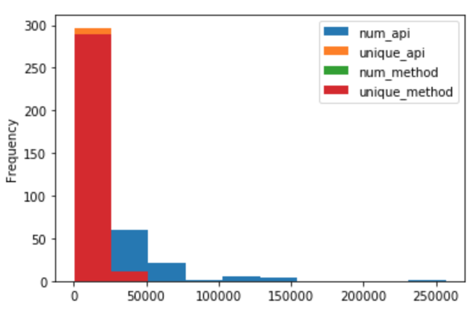
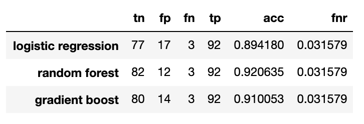
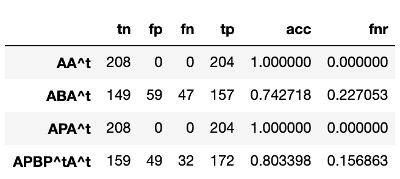
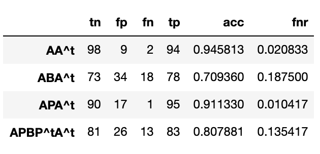

# Hindroid Replication


- [Hindroid Replication](#hindroid-replication)
    - [Repository Structure](#repository-structure)
  - [1. Malware Classification Problem](#1-malware-classification-problem)
  - [2. Datasets](#2-datasets)
    - [2.1 Datasets from Hindroid Paper](#21-datasets-from-hindroid-paper)
    - [2.2 Datasets Used in Replication](#22-datasets-used-in-replication)
      - [Advantages](#advantages)
      - [Limitations](#limitations)
  - [3. Obtaining Data](#3-obtaining-data)
  - [4. Data Ingestion Process](#4-data-ingestion-process)
    - [4.1 Data Origination and Legal Issues](#41-data-origination-and-legal-issues)
    - [4.2 Data Privacy](#42-data-privacy)
    - [4.3 Schema](#43-schema)
    - [4.4 Pipeline](#44-pipeline)
        - [triggered by `download` in targets](#triggered-by-download-in-targets)
        - [triggered by `baseline` in targets](#triggered-by-baseline-in-targets)
        - [triggered by `model` in targets](#triggered-by-model-in-targets)
    - [4.5 Applicability](#45-applicability)
  - [5. HIN Method and Graphs](#5-hin-method-and-graphs)
  - [6. EDA](#6-eda)
  - [7. Baseline Model](#7-baseline-model)
  - [8. Replication Results](#8-replication-results)
  - [9. Conclusion](#9-conclusion)


### Repository Structure
``` schema
  hindroid_replication/
  |-- Config/ #where all the configuration files are stored
  |   |-- data-params.json
  |   |-- test-params.json
  |   |-- env.json
  |-- data/ #where all data stored
  |   |-- analysis/ #main analysis data
  |   |   |-- .smali
  |   |   |-- ...
  |   |-- small_datast/ #smaller set for code development
  |   |   |-- .smali
  |   |   |-- ...
  |   |-- test-project/ #data downloaded after runngin test-project
  |   |   |-- .smali
  |   |   |-- ...
  |-- mediate/ #where all the mediate data stored
  |   |-- smalis.csv
  |   |-- malware_paths.txt
  |   |-- ...
  |-- notebook/ #where all the notebooks used to develop code and perform analysis are stored
  |   |-- analysis.ipynb
  |   |-- XXX_playground.ipynb
  |   |-- ...
  |-- output/ #where all the output files are stored
  |   |-- baseline_result.csv
  |   |-- ...
  |-- src/ #where all the functions are stored
  |   |-- baseline.py
  |   |-- ingestion.py
  |   |-- matrix.py
  |   |-- model.py
  |-- run.py
  |-- README.md


  ```


## 1. Malware Classification Problem

Android system has always been known for its openness, attracting a great amount of developers to design and implement Android applications (apps). However, this also brings serious problems to cybersecurity by introducing a channel for attackers to publish malwares that damage users. In *Hindroid* paper, it is mentioned that for every five Android applications, one malware hides itself among benign apps. To create more friendly environment and experiences for Android users, efforts have been put in to classify harmful apps from benign ones before they could have hurt users. 

The developers of *Hindroid* software also expect their product to contribute to cybersecurity by classifying harmful applications from the benign ones. They employ machine learning algorithms to investigate the Smali code decompiled from `.dex` extension files (for Android applications) to look for potential relationships among API calls, or Application Programming Interface calls.

## 2. Datasets

This section will explain datasets used for *Hindroid* development and datasets we are planning to use during replication. Data is in the form of interpretable Smali code, which is decompiled from a `.dex` extension file either downloaded from apkpure.com or obtained from other sources.

### 2.1 Datasets from Hindroid Paper

To conduct experiments, *Hindroid* developers use two training datasets, one with 1,834 Android apps and the other with 30,000 Android apps, and a test set of 500 Android apps, all roughly equally divided between malicious and benign apps, all obtained from Comodo Cloud Security Center. These apps were all collected during the first two months of 2017.

### 2.2 Datasets Used in Replication

Our dataset consists of:
1. Benign Android Application from apkpure.com that I will collect and decompile to Smali Code
2. Malware samples provided as Smali Code

Our benign part of data will represent a population of different categories of Android applications that are generally published on apkpure.com in recent years, and is thus reliable as they are all actual published Android applications. On the other hand, our malwares sample represent recognized malwares in history. Although reliable, they may be out of date and thus unable to include the newest developed malwares. This results in one of the limitation mentioned later in [limitations](#limitaions). Thus, the malware part of our data may not be exactly relevant to our question as we would like to use our program/software to classify future possible malwares for platforms. Nevertheless, our  historical data of malwares provide a general start for our development.

#### Advantages

1. Smali code files are decompiled from actual Android application **dex** files downloaded from apkpure.com. By using the platform, we not only obtain real-world perpective during training, but also improve efficiency as apkpure.com offers easier download process and publishes fewer applications compared to Playstore. 
2. Performing classification on Smali codes improves efficiency by reducing the time needed to run through applications and also avoiding possible damage from malwares.
3. The training data includes both benign and harmful applications, and is also expected to include them with generally the same shares. The balanced dataset results in better classification performance during training process.

#### Limitations

1. The collection process of app files from apkpure may result in unbalanced number of applications in each categories and also in proportions of paid or free apps (since we only download free apps).
2. There is no guarantee that all apps we collect from apkpure.com are benign, and may mislead our classification training process.
3. Our own dataset will contain newer apps collected but older malwares obtained before, causing a time discrepancy.

## 3. Obtaining Data

As mentioned above, the benign app samples will be collected and downloaded from apkpure.com. Roughly following the data collecting process explained in *Hindroid* paper, we plan to obtain a number, not too far from our malware sample size, of Android applications published on apkpure. To do this, we first obtain `sitemap.xml`, which consists of all the apps that are on apkpure.com. The pipeline created supports sampling same amount of apps in each category, and we randomly select 20 categories, while downloading 18 application for each of the category. By this sampling process, we wish to represent the whole population of apps on apkpure.com, or at least most population of apps in different categories, while also preventing the posibility of downloading too many similar apps from the same category. 

After we have have our benign app samples, we will download their **Dex** files from apkpure.com, decompile them to Smali code files, and obtain all API calls in Smali code. We will then extract features from these smali files and API call data.

## 4. Data Ingestion Process

This section will explain the whole data ingestion process and relevant details.

### 4.1 Data Origination and Legal Issues

Our dataset originates from mainly two sources, apkpure.com for the benign apps and privates sources for malwares. There will be less concern regarding obtaining malware samples as this is under authorization of the owner. We also avoid raising any legal issues as the apk files downloaded from apkpure.com are for a personal project with educational purpose. According to the [terms of use](https://apkpure.com/terms.html), apkpure suggests that visitors of it can **only use the site for personal use**. 

### 4.2 Data Privacy

As apkpure.com is a public platform for Android application installation, and all applications are open, we avoid violating data privacy. However, we can encrypt related app and developers names if necessary.

### 4.3 Schema

Our decompiled apk files will be organized in a way shown below to keep Smali code files and AndroidManifest.xml only. Although not a structured tabular form, we can organize our observations by its unit in this way. That being said, our unit of observation is an application. In this way, we can save more storage space.

``` schema
  data/
  |-- subpath/
  |   |-- Grubhub/
  |   |   |-- AndroidManifest.xml
  |   |   |-- Smali/
  |   |   |   |-- .smali
  |   |   |   |-- ...
  |   |-- Amtrak/
  |   |   |-- AndroidManifest.xml
  |   |   |-- Smali/
  |   |   |   |-- .smali
  |   |   |   |-- ...
  |   |-- ...
  ```

### 4.4 Pipeline

##### triggered by `download` in targets

- Sample a number of categories from `sitemap.xml`, then randomly sample another number of apps from each category.

- Create `config/data-params.json`, an example shown below. Information includes:
`sitemap`: our sitemap url
`malware`: directory name that the malwares are stored `outpath`: directory name that we store all our Smali code files 
`subpath`: directory name under `outpath` that can represent the category of the apps folders inside
`categories`: the categories of apps to sample from, if 'all', sample from all categories, if a number, randomly sample the number of categories, if a list, the list includes category names to be sampled from
`num`: number of applications we want in each category
`mal_num`: number of malwares we want

```json
  {
    "sitemap": "https://apkpure.com/sitemap.xml",
    "malware": "/datasets/dsc180a-wi20-public/Malware/amd_data_smali",
    "outpath": "data",
    "subpath": "analysis",
    "categories": 20,
    "num": 18,
    "mal_num": 300 
  }
  ```

  - With apktool, we eventually decompile downloaded **Dex** files to folders with Smali code files. We then organize the decompiled files according to [schema](#43-schema).

  - All procedures above are for benign app sample in our datasets. Malware samples will be given directly as Smali code files.

##### triggered by `baseline` in targets

  - After downloading benign apps, we directly access malware smali files. Then we save the paths to these smalis files in `mediate` directory. We also save smali strings as csv file and labels of data in `mediate` directory for future faster access.

  - With smali strings and labels, we perform exploratory data analysis by extracting simple features, saving the results to `output` directory.

  - We then develop and feed the simple features in our baseline models with a 2:1 train-test split, in which test results are saved to `output` directory

##### triggered by `model` in targets

  - We first retrieve all the smali dataframe and list of labels from mediate files, then construct matrices based on the smali files, matrices saved to `output` directory.

  - After create matrices, we then construct kernels, and feed these kernels in to SVM classifier with a 2:1 train-test split. The training and testing results are both saved to `output` directory.

### 4.5 Applicability

Possible similar data sources include other third-party Android application store and websites, or even the Google Playstore. Our pipeline is useful as long as a `sitemap.xml` exists for the website/store. However, our pipeline may have limited applicability depending on what other data sources we are using. For Google Playstore, it is harder to scrape and download application files as an account is required. On the other hand, our pipeline can possibly raise legal issues or privacy concern depending on each site's policy. It is important to check each Android application store or website before employing our pipeline.

## 5. HIN Method and Graphs

This section explains the definition and extraction of each graph/matrix that makes up the heterogeneous information network, or HIN, in the Hindroid paper. By defining matrices that capture the relationships among apps and API calls as well as among API calls, we are able to construct metapath kernels that can be feed into Support Vector Machine classifiers. As the apps and API calls form a HIN, metapath kernel is actually a natural way to approach the problem. In this way, we are able to assess how different similarities, or metapaths, among apps and API calls help to solve our malware detection problem.

**A** <br/>
This is a graph that explains relationship between apps and API calls. The nodes in this graph involve possible Apps and API calls. The edge of A, which is a<sub>ij</sub>, tells us that App i includes API j. We will create the graph by running through apps and find API calls included in each app.

**B** <br/>
This is a graph that explains relationships among API calls. Each node in this graph represents an API call. The edge in B, which is b<sub>ij</sub>, represents API i and API j exist in the same code block in at least one app. We will create the graph by running through all apps and find API calls that exist between `.method` and `.endmethod`.

**P** <br/>
This is another graph that explains relationships among API calls. Each node in this graph represents an API call. The edge in P, which is p<sub>ij</sub>, represents API i and API j exist in the same package in at least one app. We will create this graph by running through all apps and find API calls that include the same package name, which is after input type and before `;->`.

With these matrices, we are able to construct kernels that can be feed in to SVM classifier. In this replication project, we will be constructing the following metapath kernels: `AA^T`, `ABA^T`, `APA^T`, and `APBP^TA^T`.

**AA^T** <br/>
We interpret this metapath as if apps have similar set of API calls. If this metapath kernel produces higher accuracy or lower error metric, it means that checking if an app has similar set of APIs with malwares help our classification problem.

**ABA^T** <br/>
We interpret this metapath as if apps have API calls that are likely to co-exist in a code-block. If this metapath kernel produces higher accuracy or lower error metric, it means that checking if an app has set of APIs that are likely to co-exist in code-blocks with set of APIs of malwares help our classification problem.

**APA^T** <br/>
We interpret this metapath as if apps have API calls that are likely to use the same package. If this metapath kernel produces higher accuracy or lower error metric, it means that checking if an app has set of APIs that use similar packages with set of APIs of malwares help our classification problem.

**APBP^T A^T** <br/>
We interpret this metapath as if apps have API calls that use the similar packages co-exist in the same code-block with API calls that use similar packages of other apps. If this metapath kernel produces higher accuracy or lower error metric, it means that checking if an app has API calls with similar used packages co-exist in code-blocks with those of malwares help our classification problem.


## 6. EDA
This section includes two parts: first is an EDA done in assignment2, in which the analysis was performed on two types of apps: dating and education. The second is an EDA performed on benign and malware apps. 

The feature we extract in both include:
**num_api** : total number of API calls in the app
**unique_api** : total number of *unique* API calls in the app
**num_method** : total number of code blocks in the app
**unique_method** : total number of *unique* code blocks in the app
**most_used_package** : the package that is most called in the app

These features are extracted with regex that can identify API calls, code blocks, and packages.

The cleaning process is simple, we drop all the rows that have 0 API calls, as these are the apps that may require further access to download or that the apps are not meaningful, and we failed to download them in files.

I. Dating and Education

This part is done in EDA_assignment2 notebook.

By exploring our small sample, we have 40 total apps, half of them education type and the other half dating. The average number of total API calls is 119,750, while the average number of unique API calls is 50,280. The average total number of code blocks is 35,214, while the average number of unique code blocks is 33,490, which does not differ from the total number too much. 29 of the 40 apps here have `Ljava/lang/StringBuilder` as their mostly used library.

II. Benign and Malwares

This part is done in analysis notebook.

After performing some EDA, we observe that there are a total of 1,184,938 API calls that only appear once, while 55 API calls appear in more than 550 apps in our all 572 apps. This is computed by first constructing the A matrix, and deriving the sum for each column.

Among all 572 apps, 272 are benign while 300 are malwares. The average number of total API calls is 76,220, while the average number of unique API calls is 14,465. The average total number of code blocks is 22,037, while the average number of unique code blocks is 20,908, which does not differ from the total number too much. 490 of the 572 apps here have `Ljava/lang/StringBuilder` as their mostly used package, while 53 apps have `Landroid/os/Parcel` as their mostly used package. A more detailed table is displayed below.


We can observe that malwares have much fewer API calls and code blocks on average compared to the benign apps, which is a major reason behind the high accuracy of our baseline models. This is even more obvious with the graphs below. The top graph shows the histograms for benign apps while the lower graph show the histograms for malwares. It is visually clear that number for malwares are lower and concentrated toward the left.




## 7. Baseline Model

The baseline model uses features extracted above and the preprocess of onehot and standard scalar, along with each of Logistic Regression, Random Forest, and Gradient Boost Classifier, to classify whether the app is a benign app or a malware.

The metric chosen is the number of false negative rate and also accuracy. These specific metrics are selected because in malware classification, we care more about malwares that are accidently classified as malware.

Following is a table of the test results with one-third test-size on all the apps after training baseline models with features defined above.



## 8. Replication Results

This section presents the training and testing results by applying methods we discussed in [Graph](#5-hin-method-and-graphs) section. We train 383 apps and test the models on 189 apps. Below is the training and testing accuracy along with other metrics, the top one is training while the lower one is testing.




## 9. Conclusion

Given our EDA, baseline models, and SVM classifier with metapaths kernel, we observe that malwares have on average much fewer API calls, which result in high test accuracies in our baseline models that merely extract simple features such as number of API calls and number of code blocks. However, we want to focus more on false negative rate than just accuracies for malware detection problem. If we compare the false negative rates of baseline models and our SVM classifier with metapath kernels, we observe that the latter has lower false negative rates, which means that we leave out fewer malwares accidently classified as benign.

Among different metapath kernels, we observe that `AA^t` consistently results in higher accuracies, followed by `APA^t`. These two metapath kernels also produce lower false negative rates. We can see that both metapaths involving B matrix fail to produce obviously higher, and even produce lower, accuracies/fnr compared to our baseline models, which tells us that looking for API similarities in code-block co-existence may not be the best way to detect malwares.

To improve our model and for future possibilities, we can try implementing multikernel that weights different metapaths and determine the best weights of each metapath to detect malwares. We can also try to access newer developed malwares to make sure that our model can classify them as malwares are developed in a fast pace.